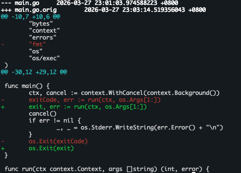

[](http://pkg.go.dev/github.com/glenntam/colordiff)
[](https://goreportcard.com/report/github.com/glenntam/colordiff)

# colordiff

Colordiff is an updated fork of [artyom](https://github.com/artyom/colordiff)'s 2022 colordiff Go port.




### Updates

- Introduces stricter linter checks.
- Passes context to the subprocess.
- Reverts coloring to match the original kimmel 1991 [colordiff](https://github.com/kimmel/colordiff).
- Adds Makefile for convenience.


### Installation

Install [Go](https://go.dev) programming language, then:

```sh
go install github.com/glenntam/colordiff@latest
```


### Usage

Exactly the same as the original:

```
colordiff file1 file2
```
or

```
diff -u file1 file2 | colordiff
```


### Motivation

This Go version is distro/arch agnostic and can be installed without root. I needed to create this the moment I was on a remote machine without root access. My eyes would have gone blind without it.
